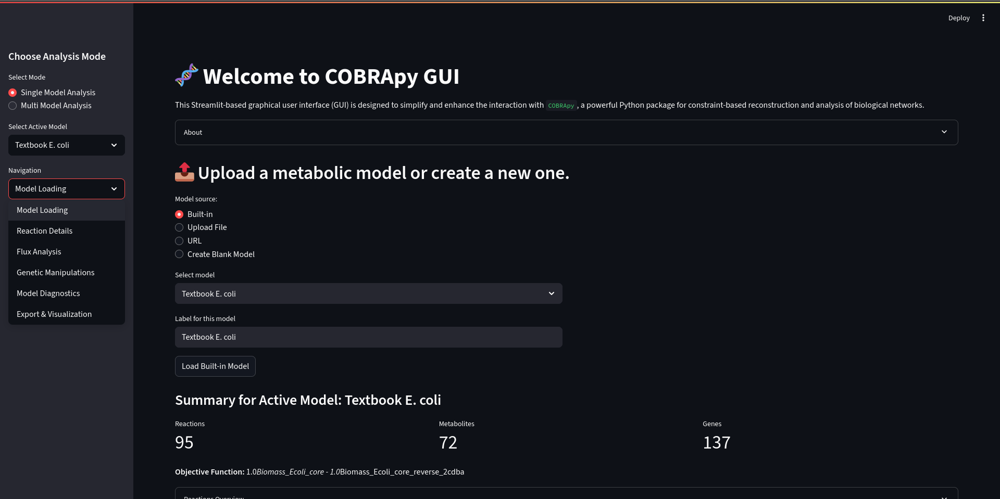

# COBRApy-GUI
Streamlit Interface for Constraint-Based Metabolic Modeling

[](https://pypi.org/project/cobra/)
[](https://pypi.org/project/cobra/)
[](https://www.python.org/downloads/release/python-3120/)
[](https://opensource.org/licenses/MPL-2.0)
[](https://streamlit.io)
[](https://git-scm.com/)

### Project Overview

`COBRApy_GUI` is a Streamlit-based graphical user interface (GUI) designed to simplify and enhance the interaction with `COBRApy`, a widely used Python package for constraint-based reconstruction and analysis of biological networks. This tool provides an visual environment for performing core metabolic modeling tasks, making complex analyses more accessible to researchers who may prefer a GUI over direct command-line interaction.



### Features

This application offers a suite of functionalities, with key `COBRApy` capabilities:

  * **Model Management:**
      * **Loading:** Supports loading metabolic models from SBML (.xml), JSON (.json), and MATLAB (.mat) formats. Includes built-in access to common `cobra` models (e.g., E. coli core, iJO1366, Recon3D).
      * **Summary & Inspection:** Provides a detailed overview of loaded models, including counts of reactions, metabolites, and genes, along with objective function details and snippets of model components.
      * **Export:** Allows users to export modified models back into SBML, JSON, or MATLAB formats.
  * **Flux Analysis:**
      * **Flux Balance Analysis (FBA):** Perform FBA to determine optimal flux distributions, with options to set objective functions and adjust reaction bounds. Visualizes flux distributions and active pathways.
      * **Parsimonious FBA (pFBA):** Execute pFBA to identify the most parsimonious (minimal total flux) solution achieving optimal growth, offering insights into metabolic efficiency. Includes FBA vs. pFBA flux comparison.
      * **Flux Variability Analysis (FVA):** Calculate the minimum and maximum possible flux for individual or all reactions, providing insights into reaction flexibility and robustness. Visualizes flux ranges.
  * **Genetic & Reaction Manipulations:**
      * **Gene Deletion Analysis:** Simulate the effects of single or double gene knockouts on the model's objective (e.g., growth rate), identifying essential genes and synthetic lethals.
      * **Reaction Deletion Analysis:** Perform single or double reaction deletions to assess their impact on model performance.
      * Visualizes growth impact of deletions and identifies lethal knockouts.
  * **Model Diagnostics:**
      * **Blocked Reactions:** Identify and optionally remove reactions that cannot carry any flux under defined conditions, aiding in model curation.
      * **Consistency Check:** Verify the solvability and consistency of the metabolic model.
  * **Model Editing:**
      * **Component Management:** Add or remove reactions, metabolites, and genes directly through the GUI.
      * **Media Conditions:** Easily modify exchange reaction bounds to simulate diverse environmental or media conditions and observe their impact on metabolism.
  * **Data Export & Visualization:**
      * Download FBA flux distributions, FVA results, and gene/reaction deletion analysis reports as CSV files for external analysis.
      * Integrated Plotly visualizations for flux distributions, FVA ranges, and growth rate impacts.

### Installation & Usage

To get started with `COBRApy_GUI`, follow these steps:

1.  **Clone the repository:**
    ```bash
    git clone https://github.com/kssrikar4/COBRApy-GUI.git
    cd COBRApy-GUI
    ```
2.  **Create a virtual environment (recommended):**
    ```bash
    python -m venv py
    source py/bin/activate  # On Windows: `py\Scripts\activate`
    ```
3.  **Install dependencies:**
    ```bash
    pip install -r requirements.txt
    ```
4.  **Run the Streamlit application:**
    ```bash
    streamlit run COBRApy_GUI.py
    ```

This will open the application in your web browser.

### How to Use

Once the `COBRApy-GUI` Streamlit application is running in your web browser, you can interact with it as follows:

  * **Navigation:** Use the **sidebar** on the left to switch between different functionalities like Model Management, Flux Analysis, Genetic Manipulations, etc.
  * **Loading Models:** In the "Model Management" section, you can either **upload your own SBML, JSON, or MATLAB model file**, or select from **pre-loaded common COBRApy models** (e.g., E. coli core) for quick exploration.
  * **Performing Analyses:** Navigate to sections like "Flux Analysis" or "Genetic & Reaction Manipulations." You'll find input fields to set parameters (e.g., objective function, reaction bounds, gene names)  to execute and analyse.
  * **Viewing Results:** Results will be displayed directly on the page, with interactive plots powered by Plotly, and options to download data.

### Contributing

We welcome contributions to `COBRApy-GUI`\! If you're interested in improving this tool, here's how you can help:

  * **Reporting Bugs:** If you encounter any issues, please open an issue on the [GitHub repository's Issues page](https://www.google.com/search?q=https://github.com/kssrikar4/COBRApy-GUI/issues).
  * **Suggesting Features:** Have an idea for a new feature or improvement? Feel free to open an issue to discuss it.
  * **Code Contributions:** Fork the repository, make your changes, and submit a pull request. Please ensure your code adheres to good practices and includes appropriate tests if applicable.


### Acknowledgements

I express my sincere gratitude to the developers and communities behind:

* **COBRApy:** The foundational Python package for constraint-based modeling. This GUI is built entirely to provide an accessible interface to its powerful functionalities.
    * [COBRApy Documentation](https://cobrapy.readthedocs.io/)
    * [COBRApy GitHub Repository](https://github.com/opencobra/cobrapy)
* **Streamlit:** The incredible framework that made it possible to build this interactive web application with pure Python, enabling rapid development of intuitive user interfaces.
    * [Streamlit Documentation](https://docs.streamlit.io/)
    * [Streamlit GitHub Repository](https://github.com/streamlit/streamlit)

Their work has advanced the fields of computational biology and web development, respectively, and made projects like `COBRApy-GUI` feasible.

### License

This project is licensed under the [Mozilla Public License 2.0](https://opensource.org/licenses/MPL-2.0).
